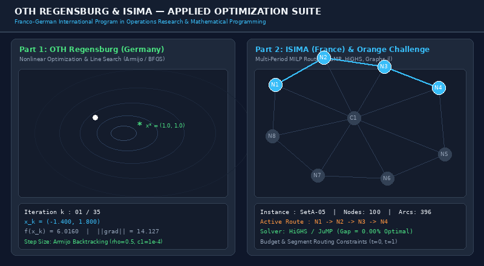
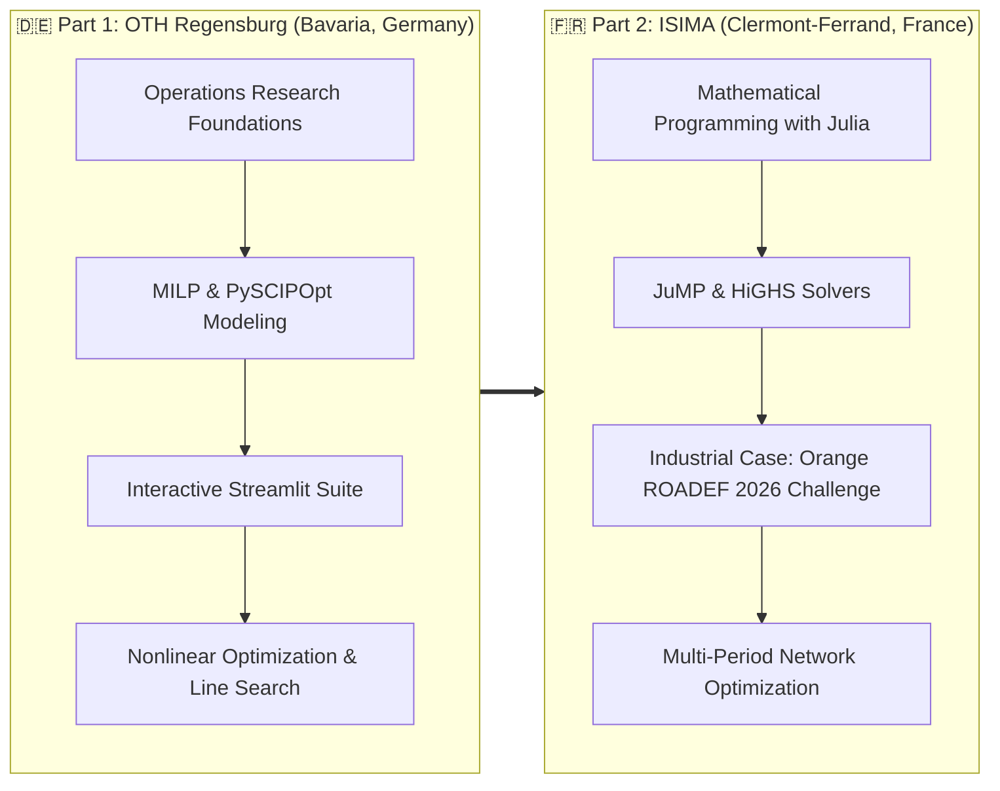
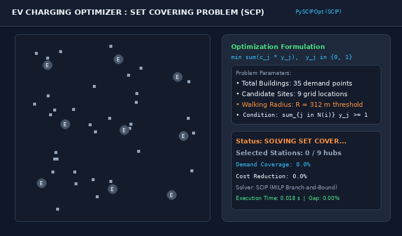
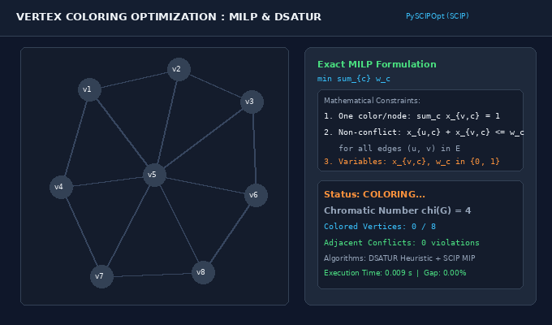
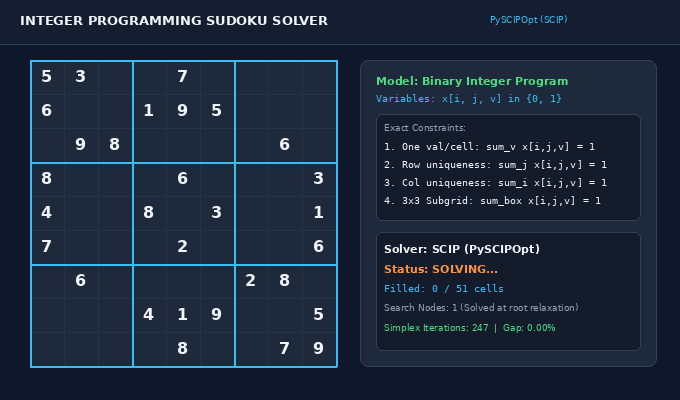
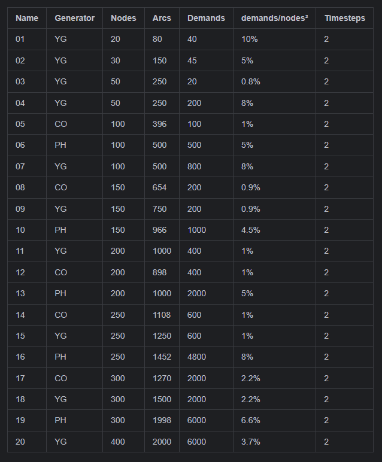

# OTH Regensburg and ISIMA Summer School : Applied Optimization and Operations Research Suite

### A Bilateral Franco-German Academic Program in Mathematical Programming, Mixed-Integer Linear Programming (MILP), and Nonlinear Optimization

<div align="center">

[](https://www.python.org/)
[_%7C_HiGHS_%7C_JuMP-F37626?style=flat-square)](https://scipopt.org/)
[](https://streamlit.io/)
[](https://www.oth-regensburg.de/)
[](https://www.ofaj.org/)
[](LICENSE)

**An applied technical and interactive journal, created during the bilateral exchange program between OTH Regensburg (Germany) and ISIMA / Clermont Auvergne INP (France).**

[Overview & Program Context](#overview--program-context) • [Portfolio Disclaimer & Contributions](#portfolio-disclaimer--my-contributions) • [Part 1: OTH Regensburg (Germany)](#part-1-oth-regensburg-germany--applied-optimization--solvers) • [Part 2: ISIMA (France)](#part-2-isima-france--telecom-network-challenge--julia) • [Repository Structure](#repository-structure) • [Quick Start Guide](#quick-start-guide) • [Key Takeaways](#key-takeaways--learning-journal) • [Authors & Credits](#authors-and-credits)

<p align="center">
  
</p>
<p align="center">
  <em>Live visualization: Left — Nonlinear Optimization with Armijo Backtracking Line Search on Rosenbrock landscape. Right — Multi-Period Telecommunication Network Routing (Orange ROADEF Challenge 2026).</em>
</p>

</div>

---

## Overview and Program Context

The **ISIMA-OTH Summer School** is an international academic partnership between **ISIMA** (Clermont-Auvergne INP, France) and **OTH Regensburg** (Ostbayerische Technische Hochschule Regensburg, Bavaria, Germany), originally established by **Prof. Dr. Markus Westner** and **Prof. Viet Hung Nguyen**.

Supported by the **Franco-German Youth Office (OFAJ / DFJW)**, the program is built on an intensive two-phase collaborative model:



1. **Phase 1 (Germany — OTH Regensburg)**: Centered around practical Operations Research, Mixed-Integer Linear Programming (MILP) with **PySCIPOpt (SCIP)**, unconstrained **Nonlinear Optimization (NOP)** with line-search heuristics, and building interactive web-based optimization decision tools in **Streamlit**.
2. **Phase 2 (France — ISIMA)**: Centered around advanced mathematical programming in **Julia** with **JuMP** and **HiGHS**, addressing the industrial challenge **Orange ROADEF 2026** for multi-period telecommunication network routing and capacity expansion under budget constraints.

---

## Portfolio Disclaimer and My Contributions

> [!NOTE]  
> 
> This repository is designed as a **technical journal and portfolio showcase** of my work and learnings during the bilateral exchange program. I did not design the theoretical problem statements or initial starter templates from scratch. The course architecture, problem formulations, and benchmark datasets were provided by the academic faculty (**Prof. Dr. Stefan Körkel**, **Prof. Dr. Ralf Lenz**, **Prof. Dr. Markus Westner**, and **Prof. Viet Hung Nguyen**) and industry partners (**Orange & ROADEF**).  
>
> My individual and team contributions consisted of:
> - Implementing mathematical constraints, objective functions, and solver bindings in **Python (PySCIPOpt)** and **Julia (JuMP)**.
> - Coding iterative numerical methods: **Gradient Descent with Armijo Backtracking Line Search** and **Quasi-Newton BFGS** updates.
> - Building and deploying the interactive multi-page **Streamlit application** for decision-making (Facility Location, EV charging, Graph coloring).
> - Developing the graph loading, latency metric matrices ($r$), and multi-period budget model for the **Orange ROADEF 2026 Challenge** in Pluto.jl.
> - Benchmarking execution times, solver gap bounds, and analyzing convergence behaviors across real-world datasets.

---

## Part 1: OTH Regensburg (Germany) — Applied Optimization & Solvers

### 1. Interactive Optimization Suite (`streamlit-suite/`)

Implemented in Python using **Streamlit** and **PySCIPOpt** (the Python interface to the SCIP Optimization Suite, one of the fastest open-source MIP solvers available).

- **Hospital Catering, Capacitated Facility Location Problem (FLP)**:
  - **Context**: Optimizing meal prep kitchen locations and delivery logistics for 70+ hospitals across the city of Berlin.
  - **Formulation**: Balances fixed opening costs for kitchen centers against variable kilometer-based transport logistics costs:
    $$\min \sum_{j \in J} f_j y_j + \sum_{i \in I} \sum_{j \in J} c_{ij} x_{ij}$$
    subject to capacity limits on kitchen facilities and complete demand coverage for all hospitals.
  - **Visualization**: Interactive Leaflet/Folium geospatial map integrating real Berlin road network Shapefiles.

- **EV Charging Station Placement — Set Covering Problem**:
  - **Context**: Locating electric vehicle charging points across urban sectors based on residential density while guaranteeing maximum walking distance thresholds.
  - **Formulation**: Classic Set Covering Problem (SCP) with binary decision variables $y_j \in \{0, 1\}$ ensuring each building block is covered by at least one charging station radius.
  <p align="center">
    
  </p>

- **Map & Graph Coloring**:
  - **Context**: Solving vertex-coloring problems for map boundaries and resource scheduling without adjacent color clashes.
  - **Formulation**: Min-color MILP formulation using indicator variables $w_c$ and assignment variables $x_{v,c}$ with edge non-interference constraints:
    $$x_{u,c} + x_{v,c} \le w_c \quad \forall (u, v) \in E, \forall c \in C$$
  <p align="center">
    
  </p>

- **Sudoku Solver**:
  - Exact formulation of standard 9×9 grids as an Integer Linear Program with row, column, and 3×3 subgrid all-different constraints, solved in milliseconds.
  <p align="center">
    
  </p>

---

### 2. Nonlinear Optimization & Numerical Methods (`nonlinear-optimization/`)

Focuses on continuous unconstrained optimization: $\min_{x \in \mathbb{R}^n} f(x)$.

- **Armijo Backtracking Line Search (`backtracking`)**:
  Computes the optimal step size $\alpha_k$ along descent direction $d_k = -\nabla f(x_k)$ by dynamically checking the sufficient decrease condition:
  $$f(x_k + \alpha_k d_k) \le f(x_k) + c_1 \alpha_k \nabla f(x_k)^T d_k$$
  preventing oscillation and divergence on steep ridges.
- **Quasi-Newton BFGS Method**:
  Approximates the inverse Hessian matrix $H_k \approx (\nabla^2 f(x_k))^{-1}$ to achieve superlinear convergence without calculating expensive second-order analytical derivatives.
- **Benchmark Test Surfaces (`functions.py`)**:
  - *Rosenbrock Banana Function*: Steep parabolic valley testing non-convex valley tracking.
  - *Himmelblau Function*: Multi-modal surface featuring 4 identical local minima.
  - *Quadratic Ellipsoids*: Verifying convergence rates and condition number sensitivities.

---

### 3. Exact Branch-and-Bound (`branch-and-bound/bb.py`)

Implementation of an explicit **Branch-and-Bound** tree exploration using PySCIPOpt, illustrating how linear relaxation bounds prune the search tree when variable integrality is violated.

---

## Part 2: ISIMA (France) — Telecom Network Challenge & Julia

### 1. Orange ROADEF Challenge 2026 (`roadef-orange-challenge/`)

The industrial challenge proposed by **Orange** in partnership with the French Operations Research Society (**ROADEF**) focuses on dynamic telecommunication network routing and capacity expansion across multiple time periods.

<div align="center">
  
</div>

#### Problem Definition
Given a directed telecommunication network graph $G = (V, A)$ with link capacities $c(a)$ and traffic latency metrics:
1. **Traffic Demands**: Traffic matrix $v(d, t)$ between origin and destination nodes across discrete time steps $t \in \{0, 1\}$.
2. **Segment Routing**: Traffic is routed using segment lists bounded by a maximum hop limit (`MaxSeg`). The shortest path latency between nodes is computed via metric matrix $r(i,j,a,t)$ (derived in [`calculating_r.pdf`](02-telecom-network-challenge-france/roadef-orange-challenge/calculating_r.pdf)).
3. **Multi-Period Horizon & Budget Constraints**: Transitioning from period $t = 0$ to $t = 1$ allows deploying extra capacity on bottlenecks, strictly constrained by a total investment budget constraint:
   $$\sum_{a \in A} \text{Cost}(a) \cdot \Delta c(a) \le \text{Budget}$$

#### Implementation Highlights (`projetV2.jl`)
- Written as a reactive **Pluto.jl** interactive notebook.
- Leverages **JuMP.jl** and the **HiGHS** simplex/interior-point solver.
- Automated parsing of JSON topologies (`setA-01` to `setA-20`) with up to 400 nodes, 2,000 arcs, and 6,000 simultaneous traffic demands.
- Output benchmark reporting: vertices, links, optimal objective value, solver CPU time, and optimality gap.

---

### 2. Operations Research Lecture Notebooks (`lecture-notebooks/`)

- **Knapsack Branch-and-Bound (`bonobo_knapsack_branch_and_bound_pluto.jl`)**:
  Interactive visualization of the Bonobo.jl Branch-and-Bound tree, highlighting active nodes, fathomed branches, and relaxation upper bounds.
- **TSP Branch-and-Cut (`tsp_branch_and_cut_exercise_pluto.jl`)**:
  Solving the Traveling Salesperson Problem by starting from the 2-matching relaxation and dynamically injecting lazy subtour elimination constraints (Dantzig-Fulkerson-Johnson formulation).
- **Project Scheduling & Resource Allocation (`ProjectScheduling1_data.jl`)**:
  Discrete event scheduling with precedence dependencies and critical path evaluation.

---

## Repository Structure

```text
Summer-school-OTH-ISIMA/
├── 01-applied-optimization-germany/          # Part 1: OTH Regensburg (Germany)
│   ├── streamlit-suite/                     # Multi-problem Interactive Web Suite
│   │   ├── main_app.py                      # Streamlit entrypoint
│   │   ├── pages/                           # Sub-apps (FLP, Set Cover, Graph Coloring, Sudoku)
│   │   ├── flp/                             # Facility Location Problem (Berlin hospitals data & maps)
│   │   ├── set_cover/                       # EV Charging Placement Optimizer
│   │   └── graph_coloring/                  # Vertex Coloring MILP solver
│   ├── nonlinear-optimization/              # Unconstrained Nonlinear Methods & Line Search
│   │   ├── NOP_template.py                  # Gradient Descent, Armijo Backtracking, BFGS
│   │   ├── functions.py                     # 2D/3D test surfaces (Rosenbrock, Himmelblau, Quadratic)
│   │   └── explication.md                   # Algorithm walkthrough & mathematical notes
│   ├── branch-and-bound/                    # Exact Integer Programming
│   │   └── bb.py                            # SCIP Branch-and-Bound manual exploration
│   └── requirements.txt                     # Python dependencies
│
├── 02-telecom-network-challenge-france/     # Part 2: ISIMA (France)
│   ├── roadef-orange-challenge/             # Multi-Period Telecom Optimization
│   │   ├── projetV2.jl                      # Interactive Pluto.jl notebook (Network model & JuMP)
│   │   ├── Challenge_Orange_ROADEF_2026_Subject.pdf # Official challenge specification
│   │   ├── calculating_r.pdf                # Shortest path latency calculation rules
│   │   ├── Project.toml / Manifest.toml     # Julia package environment
│   │   ├── scripts/                         # Graph parsing and path utilities
│   │   └── setA/                            # 20 benchmark network instances (JSON)
│   └── lecture-notebooks/                   # Operations Research Notebooks & Slides
│       ├── Mathematical-Programming-with-Julia.pdf # Course reference handbook
│       ├── bonobo_knapsack_branch_and_bound_pluto.jl # Knapsack B&B tree solver
│       ├── tsp_branch_and_cut_exercise_pluto.jl     # TSP with dynamic cut generation
│       └── lecture-slides/                  # Slide decks (Julia, MILP, scheduling)
│
├── images/                                  # Visual assets for documentation
│   ├── optimization_suite_demo.gif          # Animated dual-panel optimization GIF
│   ├── hospitals_berlin.png                 # Hospital catering icon
│   └── roadef_instances_summary.png         # Benchmark instance metrics table
│
├── .gitignore                               # Clean exclusion of venvs, caches, and binaries
├── LICENSE                                  # MIT License
└── README.md                                # Project presentation
```

---

## Quick Start Guide

### Running the Python Optimization Suite (Part 1)

```bash
# 1. Clone repository
git clone https://github.com/lyko27/Summer-school-OTH-ISIMA.git
cd Summer-school-OTH-ISIMA/01-applied-optimization-germany

# 2. Install dependencies
pip install -r requirements.txt

# 3. Launch the Streamlit Optimization Suite
cd streamlit-suite
streamlit run main_app.py
```

### Running the Nonlinear Optimization Benchmark

```bash
cd 01-applied-optimization-germany/nonlinear-optimization
python3 NOP_template.py
```

### Running the Julia Pluto Notebook (Part 2)

```bash
# 1. Start Julia and launch Pluto
julia -e 'using Pkg; Pkg.add("Pluto"); using Pluto; Pluto.run()'

# 2. In your browser, open:
# 02-telecom-network-challenge-france/roadef-orange-challenge/projetV2.jl
```

---

## Key Takeaways and Learning Journal

### 1. Operations Research in Practice
- **MIP Solvers Matter**: SCIP and HiGHS demonstrate that choosing the proper solver and formulation drastically impacts branch-and-bound pruning rates.
- **Decomposition & Relaxation**: Real-world constraints (e.g., telecom routing or facility location) are often intractable if formulated naively; understanding linear relaxation and dual bounds is key to finding tight optimality guarantees.

### 2. Algorithmic Versatility
- **Continuous vs. Combinatorial**: Bridging the gap between gradient-based continuous optimization (Armijo line search, quasi-Newton) and discrete combinatorial optimization (MILP, set covering, graph coloring).
- **Modern Tech Stack**: Gained hands-on proficiency in **Python (PySCIPOpt, Streamlit)** and **Julia (JuMP, Pluto.jl, HiGHS)**.

### 3. International Academic Collaboration
- Working in an international, bilingual team with German and French students, adapting to different modeling methodologies, and defending technical solutions in English.

---

## Authors and Credits

- **Natéo Gadaix** ([@lyko27](https://github.com/lyko27)) — Student Software Engineer @ [ISIMA](https://www.isima.fr/) (Clermont Auvergne INP)  
  - LinkedIn: [Natéo Gadaix](https://www.linkedin.com/in/nat%C3%A9o-gadaix-7507a0383/)  
  - Portfolio: [perso.isima.fr/~nagadaix](https://perso.isima.fr/~nagadaix/)
- **Academic Directors & Lecturers**:
  - **Prof. Dr. Stefan Körkel** — Ostbayerische Technische Hochschule (OTH) Regensburg, Faculty of Computer Science and Mathematics (Applied Mathematics, Non-Linear Optimization & Mixed-Integer Programming)
  - **Prof. Dr. Ralf Lenz** — Ostbayerische Technische Hochschule (OTH) Regensburg, Faculty of Computer Science and Mathematics (Mathematical Optimization & Operations Research)
  - **Prof. Dr. Markus Westner** — Ostbayerische Technische Hochschule (OTH) Regensburg (Program Director & General Supervision)
  - **Prof. Viet Hung Nguyen** — ISIMA / LIMOS (CNRS), Université Clermont Auvergne, France (Program Director & Mathematical Programming with Julia)
- **Institutions & Sponsors**:
  - **[OTH Regensburg](https://www.oth-regensburg.de/)** & **[ISIMA](https://www.isima.fr/)**
  - **[OFAJ / DFJW](https://www.ofaj.org/)** (Office Franco-Allemand pour la Jeunesse / Deutsch-Französisches Jugendwerk)
  - **Orange** & **ROADEF** (Société Française de Recherche Opérationnelle et d'Aide à la Décision)

---

## License

This repository is distributed under the [MIT License](LICENSE).
